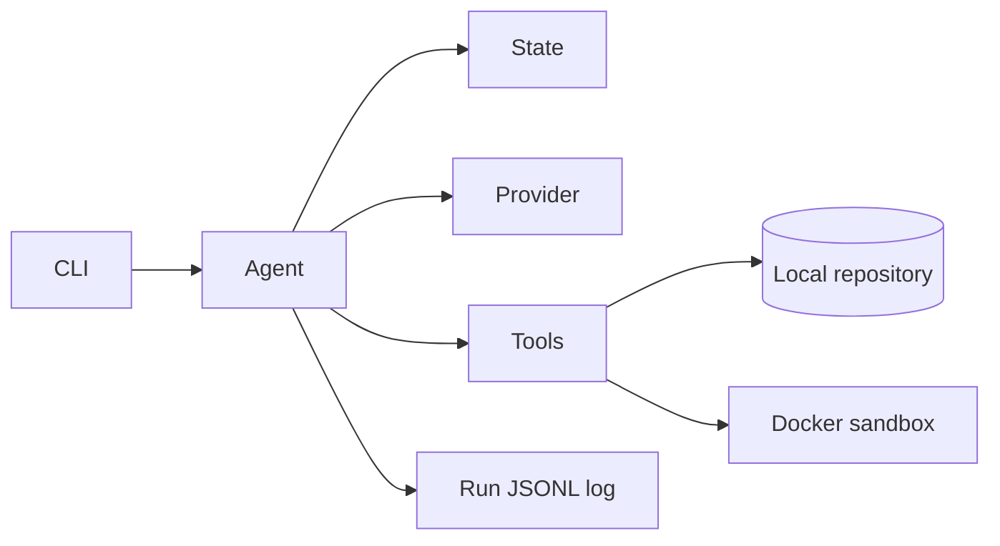

# AutoDev

AutoDev 是一个面向本地 Git 仓库的 Autonomous Coding Agent。v0.1 先建立可测试的核心边界：仓库分析、工具调用、沙箱命令执行、状态记录和 C++ 基准项目。

## 架构



完整设计见 [ARCHITECTURE.md](ARCHITECTURE.md)。

## 安装

```bash
python -m venv .venv
.venv\Scripts\activate       # Windows
pip install -e ".[test]"
```

同时需要 Docker Engine/Desktop、CMake、CTest 和 Git。用 `autodev doctor` 检查它们是否在 PATH 中。

项目包含 GitHub Actions CI（`.github/workflows/ci.yml`）。如果本机没有 Docker，可以推送到 GitHub，由 Linux runner 自动完成 Python、Docker、CMake、CTest 和 Benchmark 验证。

## 配置

复制 `.env.example`，并在运行环境中设置 `LLM_BASE_URL`、`LLM_API_KEY`、`LLM_MODEL`。API key 不写入代码或日志。

## 运行 Agent

设置兼容模型环境变量后，可以对本地仓库运行有限迭代 Agent：

```bash
autodev run --repo ./benchmarks/cpp_bug_001 --task "修复 calculate_average 函数，使全部测试通过"
```

如果希望每次编辑后自动验证，可显式提供验证命令：

```bash
autodev run --repo ./benchmarks/cpp_bug_001 \
  --task "修复 calculate_average 函数，使全部测试通过" \
  --verify-command "ctest --test-dir build --output-on-failure"
```

编辑成功后 Agent 会自动进入 `VERIFY`，在 Docker 中执行该命令；失败输出会进入下一轮 `REFLECT`/重试。

每轮模型必须返回一个 JSON 动作：`plan`、一个工具调用，或 `finish`。运行事件写入目标仓库的 `.autodev/run.jsonl`。

运行前可以检查本机依赖：

```bash
autodev doctor
```

## 当前可运行内容

```bash
pytest
cmake -S benchmarks/cpp_bug_001 -B benchmarks/cpp_bug_001/build
cmake --build benchmarks/cpp_bug_001/build
ctest --test-dir benchmarks/cpp_bug_001/build --output-on-failure
```

Windows 使用 Visual Studio 多配置生成器时请加配置名：

```powershell
ctest --test-dir benchmarks/cpp_bug_001/build -C Debug --output-on-failure
```

Benchmark 初始测试应失败，因为 `calculate_average` 使用了整数除法。

## 推荐使用流程

1. `autodev doctor` 检查 Python、Docker、CMake、CTest。
2. 配置三个 `LLM_*` 环境变量。
3. 先手动运行 Benchmark，确认初始测试失败。
4. 执行 `autodev run --repo <repo> --task "<task>"`。
5. 查看终端输出中的最终状态和统计，并检查 `<repo>/.autodev/run.jsonl`。
6. 使用 `git diff` 审阅 Agent 修改，重新运行 CTest 验证结果。

## 当前限制与路线图

当前 loop 已支持有限迭代、结构化动作、工具结果和 JSONL 事件日志；仍未实现自动测试命令推断、错误反思提示优化、Docker 镜像构建与完整修复演示。
